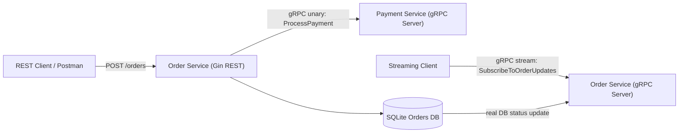

# AP2 Assignment 2 - gRPC Migration & Contract-First Development

This repository contains a complete sample solution for the Assignment 2 requirements:

- `Order Service` keeps its external REST API with Gin.
- `Order Service` calls `Payment Service` internally via gRPC.
- `Payment Service` exposes a gRPC server with unary `ProcessPayment`.
- `Order Service` exposes a gRPC server with server-side streaming `SubscribeToOrderUpdates`.
- Order status streaming is tied to real database updates in SQLite.
- Configuration is loaded from environment variables.
- A GitHub Actions workflow template is included for contract-first remote generation.

## Project Structure

```text
cmd/
  order-service/
  payment-service/
  order-stream-client/
internal/
  config/
  order/
    delivery/
    domain/
    repository/
    stream/
    usecase/
  payment/
    delivery/
    domain/
    usecase/
  shared/
proto/
  order/v1/
  payment/v1/
pkg/gen/
```

## Architecture



## Proto Repositories

To match the assignment exactly, use:

- Repository A: proto-only repository
- Repository B: generated Go code repository

Update this README with your real GitHub links before submission:

- Proto Repository: `https://github.com/your-user/your-proto-repo`
- Generated Code Repository: `https://github.com/your-user/your-generated-repo`

The included workflow in `.github/workflows/proto-generate.yml` is a template for the remote generation flow.

## Environment Variables

Copy `.env.example` to `.env`.

```env
ORDER_HTTP_PORT=8080
ORDER_GRPC_HOST=localhost
ORDER_GRPC_PORT=50052
PAYMENT_GRPC_HOST=localhost
PAYMENT_GRPC_PORT=50051
ORDER_DATABASE_PATH=data/orders.db
PAYMENT_DEFAULT_MESSAGE=payment processed successfully
```

## Generate Protobuf Code

```bash
export PATH="$PATH:$(go env GOPATH)/bin"
protoc -I ./proto \
  --go_out=. --go_opt=module=github.com/arslanmaratbekov/ap2-assignment2 \
  --go-grpc_out=. --go-grpc_opt=module=github.com/arslanmaratbekov/ap2-assignment2 \
  proto/payment/v1/payment.proto \
  proto/order/v1/order.proto
```

## Run Services

1. Start Payment Service:

```bash
go run ./cmd/payment-service
```

2. Start Order Service:

```bash
go run ./cmd/order-service
```

3. Create an order:

```bash
curl -X POST http://localhost:8080/orders \
  -H "Content-Type: application/json" \
  -d '{
    "user_id":"user-1",
    "amount":150,
    "currency":"usd"
  }'
```

4. Subscribe to updates:

```bash
go run ./cmd/order-stream-client --order-id=<ORDER_ID>
```

5. Update order status to prove DB-backed streaming:

```bash
curl -X PATCH http://localhost:8080/orders/<ORDER_ID>/status \
  -H "Content-Type: application/json" \
  -d '{"status":"CANCELLED"}'
```

When the status is updated in SQLite, the gRPC stream immediately pushes the update to the streaming client.

If port `8080` is already busy on your laptop, run the Order Service with another HTTP port:

```bash
ORDER_HTTP_PORT=18080 go run ./cmd/order-service
```

## Requirements Coverage

- Contract-First Flow: `proto/*.proto`, generated code under `pkg/gen`, workflow template for remote generation
- gRPC Implementation: unary gRPC in Payment, gRPC client in Order, streaming gRPC in Order
- Proto Design & Config: proper `package`, `go_package`, `google.protobuf.Timestamp`, env-based addresses
- Streaming & DB Integration: stream notification is triggered only after successful DB status update
- Documentation & Git: README, architecture diagram, and commands to demonstrate the migration
- Bonus: Payment service unary interceptor logs every incoming request with method name and duration
