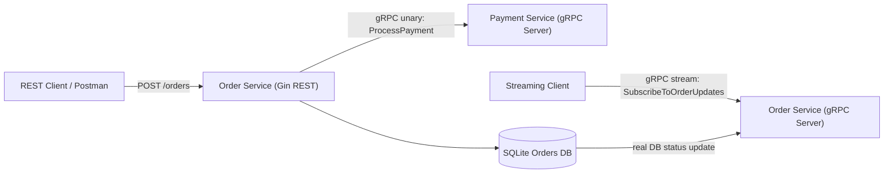

# AP2 Assignment 2: gRPC Migration and Contract-First Development

This project is a complete solution for the Assignment 2 requirements from Advanced Programming 2.

The system demonstrates the following:

- `Order Service` keeps its external REST API using Gin.
- `Order Service` communicates with `Payment Service` internally via gRPC.
- `Payment Service` exposes a unary gRPC method named `ProcessPayment`.
- `Order Service` exposes a server-side streaming gRPC method named `SubscribeToOrderUpdates`.
- Order status streaming is connected to real database updates in SQLite.
- Service configuration is loaded from environment variables.
- A GitHub Actions template is included for a contract-first remote generation workflow.

## Project Structure

```text
cmd/
  order-service/
  payment-service/
  order-stream-client/
internal/
  config/
  order/
    delivery/
    domain/
    repository/
    stream/
    usecase/
  payment/
    delivery/
    domain/
    usecase/
  shared/
proto/
  order/v1/
  payment/v1/
pkg/gen/
```

## Architecture



## Contract-First Repositories

To follow the assignment requirements, the project uses separate repositories for contracts and generated code:

- Repository A: proto-only repository
- Repository B: generated Go code repository

- Main Project Repository: `https://github.com/maratbekovalikhan/ap2-assignment2`
- Proto Repository: `https://github.com/maratbekovalikhan/ap2-protos`
- Generated Code Repository: `https://github.com/maratbekovalikhan/ap2-generated`

The included workflow in `.github/workflows/proto-generate.yml` is a template for the remote generation flow.

## Environment Variables

Copy `.env.example` to `.env`.

```env
ORDER_HTTP_PORT=8080
ORDER_GRPC_HOST=localhost
ORDER_GRPC_PORT=50052
PAYMENT_GRPC_HOST=localhost
PAYMENT_GRPC_PORT=50051
ORDER_DATABASE_PATH=data/orders.db
PAYMENT_DEFAULT_MESSAGE=payment processed successfully
```

## Generate Protobuf Code

```bash
export PATH="$PATH:$(go env GOPATH)/bin"
protoc -I ./proto \
  --go_out=. --go_opt=module=github.com/arslanmaratbekov/ap2-assignment2 \
  --go-grpc_out=. --go-grpc_opt=module=github.com/arslanmaratbekov/ap2-assignment2 \
  proto/payment/v1/payment.proto \
  proto/order/v1/order.proto
```

## How to Run the Services

1. Start Payment Service:

```bash
go run ./cmd/payment-service
```

2. Start Order Service:

```bash
go run ./cmd/order-service
```

3. Create an order through the REST API:

```bash
curl -X POST http://localhost:8080/orders \
  -H "Content-Type: application/json" \
  -d '{
    "user_id":"user-1",
    "amount":150,
    "currency":"usd"
  }'
```

4. Subscribe to order status updates through gRPC:

```bash
go run ./cmd/order-stream-client --order-id=<ORDER_ID>
```

5. Update the order status to demonstrate DB-backed streaming:

```bash
curl -X PATCH http://localhost:8080/orders/<ORDER_ID>/status \
  -H "Content-Type: application/json" \
  -d '{"status":"CANCELLED"}'
```

When the order status is updated in SQLite, the gRPC stream immediately pushes the new status to the subscriber.

If port `8080` is already in use on your machine, run the Order Service with another HTTP port:

```bash
ORDER_HTTP_PORT=18080 go run ./cmd/order-service
```

## Requirements Coverage

## Evolution / Assignment 1 (REST)

This repository contains two logical versions of the assignment:

- Assignment 2 (gRPC) is the primary implementation on the `main` branch.
- Assignment 1 (original REST solution) is preserved in the branch named `assignment1-rest`.

You can view the REST solution on GitHub here:

https://github.com/maratbekovalikhan/ap2-assignment2/tree/assignment1-rest

How to run Assignment 1 (REST) locally

1. Order Service (A1)

```bash
cd assignment1-rest/order-service
go run ./cmd
```

2. Payment Service (A1)

```bash
cd assignment1-rest/payment-service
go run ./cmd
```

Notes:
- Each A1 service has its own `go.mod` so it is easiest to `cd` into the service folder before running.
- The `assignment1-rest` branch is intended to show the project evolution (REST → gRPC). The instructor can compare branches or open a pull request to review the changes.


- Contract-First Flow: `proto/*.proto`, generated code under `pkg/gen`, and a workflow template for remote generation
- gRPC Implementation: unary gRPC in `Payment Service`, gRPC client inside `Order Service`, and server-side streaming in `Order Service`
- Proto Design and Configuration: proper `package`, `go_package`, `google.protobuf.Timestamp`, and environment-based addresses
- Streaming and Database Integration: stream notifications are triggered only after a successful database status update
- Documentation and Git: README, architecture diagram, and clear commands to demonstrate the migration
- Bonus Requirement: `Payment Service` includes a unary interceptor that logs method name and duration
